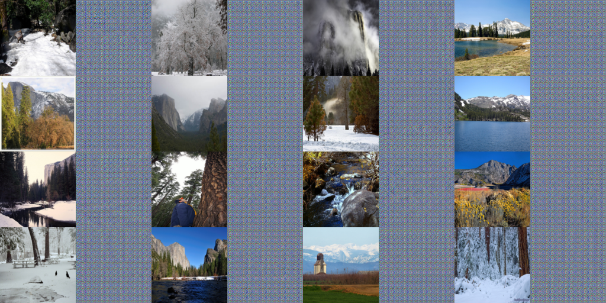
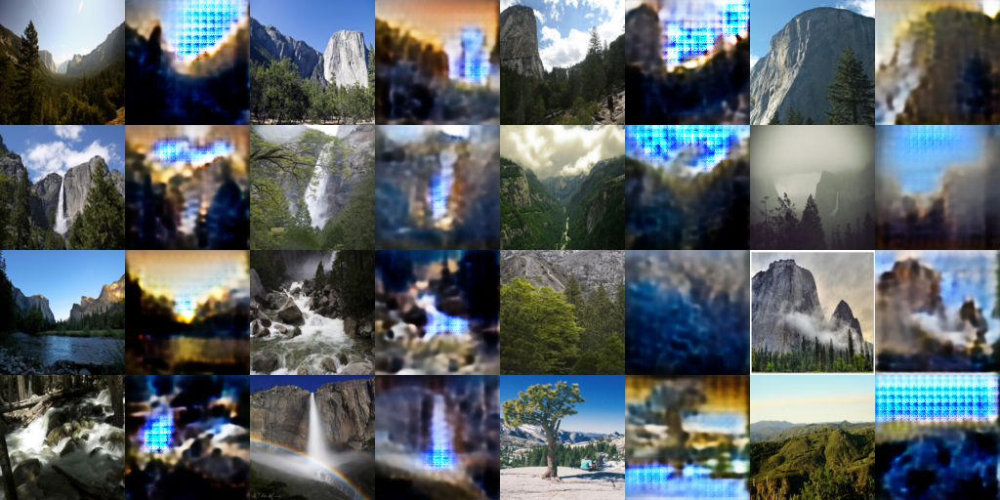

# A rather simple CycleGAN

This notebook is part of the Udacity Deep Learning Nanodegree and it is based from one of their notebooks!

This repo showcases a notebook where a [CycleGAN](https://arxiv.org/abs/1703.10593) is defined and trained to read an image from a domain X and transform it so it looks as if it belongs in domain Y. Specifically, we are going to look at a set of images from Yosemite National Park taken during summer and winter and changed between these two domains!

The images do not come with labels but CycleGANs give us a way to learn the mapping between these two domains using an unsupervised approach. After all, CycleGAN is defisned for image-to-image translation and it learns from unpaired training data.

If there are some changes or any ML blasphemies that I committed here and there, feel free to open an issue and point me to the right direction! I'm just learning after all! :smile:

## Example output
This notebook is a proof of concept so it is not meant to yield realistic images. In fact, one shortcoming of this model is that it produces fairly low-resolution images. This is an ongoing area of research and there have been attempts to create higher-resolution formulations that use multi-slace generator models, as described in [this paper](https://arxiv.org/abs/1711.11585).

We can see the progress of yielding images from the other domain and how it fares much better as the model is trained through iterations!

First iterations             |  After 8000 training iterations
:-------------------------:|:-------------------------:
  |  

## License

